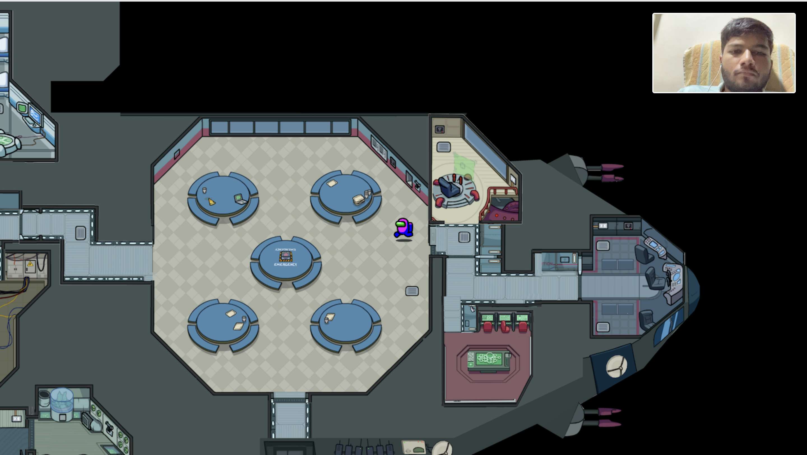

🏠 Virtual Space
Virtual Space is a real-time, multiplayer environment inspired by Gather.town, built using React, Phaser.js, Socket.IO, and Express.js. It allows users to interact in a shared 2D map with real-time movement and communication features.

⚠️ This project is under active development. Media streaming via Mediasoup is planned but not yet integrated.

🫁 Features
👉 Multiplayer room creation and joining

👉 Real-time player movement using Phaser.js

👉 WebSocket communication via Socket.IO

👉 Express.js backend API and server

🚧 Upcoming: Peer-to-peer video/audio communication with Mediasoup

🗺️ Map inspired by Among Us-style 2D layout

## 📸 Screenshot

  
Basic multiplayer with two avatars in a shared Phaser environment

## 🛠 Tech Stack

| Frontend       | Backend    | Realtime  | Media               |
| -------------- | ---------- | --------- | ------------------- |
| React + Phaser | Express.js | Socket.IO | Mediasoup (planned) |

🏁 Getting Started

1. Clone the repo
   bash
   Copy
   Edit
   git clone https://github.com/AdityaGhamat/virtual-space.git
   cd virtual-space
2. Install dependencies
   bash
   Copy
   Edit
   npm install
3. Start the development server
   bash
   Copy
   Edit

# For backend

cd server
npm run dev

# For frontend

cd client
npm start 4. Open the app
Go to http://localhost:3000 and join a room!

📦 Folder Structure
csharp
Copy
Edit
virtual-space/
├── client/ # React + Phaser frontend
├── server/ # Express.js + Socket.IO backend
├── public/ # Static assets (if any)
└── README.md
🎯 Roadmap
Player movement and collisions

Room-based multiplayer

Mediasoup integration (video/audio)

Room chat and interactions

Map editor or dynamic map loader

🤝 Contributing
Pull requests and suggestions are welcome. Let’s build a better virtual space!
